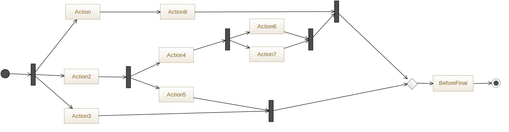
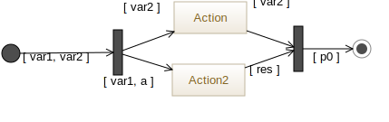
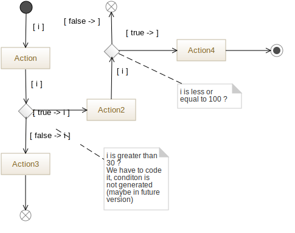

# UML To ArnoldC

This project provides facilities to generate [ArnoldC](https://github.com/lhartikk/ArnoldC) code from UML Activity Diagrams and to easily
create powerful code samples that could amaze your friends, maybe.


## "I don't know what the problem is, but I'm sure it can be solved without resorting to violence."

We choose to translate activity diagrams into ArnoldC implementation of kind of but not necessarily petri nets. This way, we can express
a kind of synchronization (more a precedence idea actually) without having to compute a function calls graph during generation. 
The idea is to generated functions that call others from the initial node of an activity. Thus, each activity is seen as a module whereas each `action`, `decision/merge node`,
`fork/join` node is translated as a function with parameters. Each `control flow` is translated as a function call and `guard` on `control flow` are used to pass parameters from
function to others. 

Obviously, different type of node implies a different generation. Action are only simple action taking parameters and making calls. The same translation is applied for merge nodes
and fork nodes. The two special kind of nodes are the `join node` and the `decision node`. A `decision node` is translated as two functions: a `decision` function and a `predicate` 
function (that is generated as returning true). The `decision` function calls the `predicate` one and, following the result, performs the calls contained in `then` or `else`. A `join node`
is translated as a function that count each time it is called. Thus, if a join node has 3 incoming `control flow`, it should be called 3 times before it can call other functions. Also, 
`control flow` are parsed to extract parameter variables and created variables. The identified variables are then used as function parameters.
Finally, each activity is generated in a single file as well as a `main` and a library used by the generated code. 

Going from activity diagrams to ArnoldC is not an ultra-easy task because of some ArnoldC features. As you probably know, ArnoldC only 
handle integer variables. Consequently, function can only return one integer. There is also no `inout` function parameter or global variables (or we
didn't find how to do). In order to keep global information about visited `join nodes`, we built a pseudo-structure by cutting an integer in 10 different position. Each position 
is relative to a join node and each join node owns an ID (generated). This way, by passing this integer to functions as parameter, we can *simulate* a global registry. The 
implied limitation is that we only can store 10 values in the [0-9] interval. In other words, you can only use 10 `join` per activity to synchronize at most 9 `action` per `join`.

As ArnoldC code have to be in a single file, a little `sh` script is generated with the code. This file merge all the `.arnoldc` produced from an UML model (so from each `Activity`)
and launch the result. 


## "Come with me if you want to live."

So, how to use this generator. It relies on eclipse UML models and Acceleo script. 

Try it online. It can be used as a custom generator for GenMyModel. Just register it: menu `Tools->Custom Generator` then, `Add` a new custom gen and fill the 
form with the following information:

     Generator name: ArnoldC
     Github URL: https://github.com/aranega/uml2arnoldc.git

Do not forget to clic `Save`. To lauch a generation, open a project, go to the custom generator manager and clic on `Launch`.

You can also use this generator in a desktop environement as an `Eclipse` project. Import the Acceleo script into an `Acceleo` Eclipse project, build an UML model with activities, 
configure and run the generation script. In order to easily install `Acceleo`, we recommend you to download the [*Modeling version*](https://www.eclipse.org/downloads/packages/eclipse-modeling-tools/lunar) 
of Eclipse.

## "First I'm gonna use you as a human shield, then I gonna take that chisel and kill the guard with it. Then I was thinking about breaking your neck."

As examples are easier to understand, here is a very simple activity diagram providing `fork`, `join` and `actions` nodes (and `initial` and `final` node of course). You can find
the presented examples [here](https://repository.genmymodel.com/vincent.aranega/ArnoldExamples).


This diagram expresses that the `Action1` and `Action2` have no call order, but they have to be finished before going to the end. Here is the generated code:

```
LISTEN TO ME VERY CAREFULLY simpleSync
	HEY CHRISTMAS TREE state
	YOU SET US UP 0000000000
	DO IT NOW ForkNodeFromSimpleSync state 
HASTA LA VISTA, BABY

LISTEN TO ME VERY CAREFULLY Action2FromSimpleSync
I NEED YOUR CLOTHES YOUR BOOTS AND YOUR MOTORCYCLE state
GIVE THESE PEOPLE AIR 
	TALK TO THE HAND "Entering Action2FromSimpleSync"
	GET YOUR ASS TO MARS state
	DO IT NOW JoinNodeFromSimpleSync state 
	I'LL BE BACK state
HASTA LA VISTA, BABY

LISTEN TO ME VERY CAREFULLY ForkNodeFromSimpleSync
I NEED YOUR CLOTHES YOUR BOOTS AND YOUR MOTORCYCLE state
GIVE THESE PEOPLE AIR 
	GET YOUR ASS TO MARS state
	DO IT NOW Action2FromSimpleSync state 
	GET YOUR ASS TO MARS state
	DO IT NOW ActionFromSimpleSync state 
	I'LL BE BACK state
HASTA LA VISTA, BABY

LISTEN TO ME VERY CAREFULLY ActionFromSimpleSync
I NEED YOUR CLOTHES YOUR BOOTS AND YOUR MOTORCYCLE state
GIVE THESE PEOPLE AIR 
	TALK TO THE HAND "Entering ActionFromSimpleSync"
	GET YOUR ASS TO MARS state
	DO IT NOW JoinNodeFromSimpleSync state 
	I'LL BE BACK state
HASTA LA VISTA, BABY

LISTEN TO ME VERY CAREFULLY ActivityFinalNodeFromSimpleSync
I NEED YOUR CLOTHES YOUR BOOTS AND YOUR MOTORCYCLE state
GIVE THESE PEOPLE AIR
	TALK TO THE HAND "END FROM JoinNodeFromSimpleSync"
	I'LL BE BACK state
HASTA LA VISTA, BABY

LISTEN TO ME VERY CAREFULLY JoinNodeFromSimpleSync
I NEED YOUR CLOTHES YOUR BOOTS AND YOUR MOTORCYCLE state
GIVE THESE PEOPLE AIR

	GET YOUR ASS TO MARS state
	DO IT NOW incState state 1

	HEY CHRISTMAS TREE myState
	YOU SET US UP 0
	GET YOUR ASS TO MARS myState
	DO IT NOW getState state 1
	GET TO THE CHOPPER myState
	HERE IS MY INVITATION myState
	YOU ARE NOT YOU YOU ARE ME 2
	ENOUGH TALK
	BECAUSE I'M GOING TO SAY PLEASE myState
		GET YOUR ASS TO MARS state
		DO IT NOW ActivityFinalNodeFromSimpleSync state 
	YOU HAVE NO RESPECT FOR LOGIC
		
	I'LL BE BACK state
HASTA LA VISTA, BABY
```

There is two functions `incState` and `getState` that are generated in a `stateLibrary.arnoldc` file. The rest of the code performs the checks and the calls.

Here is a `main.arnoldc`
```
IT'S SHOWTIME
	DO IT NOW simpleSync	
YOU HAVE BEEN TERMINATED
```

And the execution.

    $ sh ./ThisHeroStuffHasItsLimits.sh
    Merging files...
    Launching...
    Entering Action2FromSimpleSync
    Entering ActionFromSimpleSync
    END FROM JoinNodeFromSimpleSync

We can clearly see that first, `Action2` had been executed, then `Action` before ending. The implied semantic from the input model is thus respected.

Here is another more complex example.



And the produced execution.

    $ sh ./ThisHeroStuffHasItsLimits.sh
    Merging files...
    Launching...
    Entering Action3FromComplexeSync
    Entering Action2FromComplexeSync
    Entering Action5FromComplexeSync
    Entering BeforeFinalFromComplexeSync
    END FROM BeforeFinalFromComplexeSync
    Entering Action4FromComplexeSync
    Entering Action7FromComplexeSync
    Entering Action6FromComplexeSync
    Entering ActionFromComplexeSync
    Entering Action8FromComplexeSync
    Entering BeforeFinalFromComplexeSync
    END FROM BeforeFinalFromComplexeSync

In the following example, we use vaiables. This activity expresses that two variables: `var1 and var2` are passed from the `initial node`. From these two variables `Action` received `var2` and
`Action2` received `var1` and a new variable: `a`. Then, `Action2` gives `var2` to the `join node` and `Action2` gives a new variable `res` to the `join node`. Unfortunately, we cannot predict
which value (`var2` or `res`) will be given to the `join node` because of the implementation we generate. Then, from this `join node` a variable `p0` is given to the `final node`. This variable
will have either the `var2` value or the `res` value following the execution. More generally, each variable going from a `join node` to another node are named `p0, p1 ...`.



Here is the generated code.

```
LISTEN TO ME VERY CAREFULLY withVars
I NEED YOUR CLOTHES YOUR BOOTS AND YOUR MOTORCYCLE var1
I NEED YOUR CLOTHES YOUR BOOTS AND YOUR MOTORCYCLE var2
	HEY CHRISTMAS TREE state
	YOU SET US UP 0000000000
	DO IT NOW ForkNodeFromWithVars state var1 var2
HASTA LA VISTA, BABY

LISTEN TO ME VERY CAREFULLY ActivityFinalNodeFromWithVars
I NEED YOUR CLOTHES YOUR BOOTS AND YOUR MOTORCYCLE state
I NEED YOUR CLOTHES YOUR BOOTS AND YOUR MOTORCYCLE p0
GIVE THESE PEOPLE AIR
	TALK TO THE HAND "END FROM JoinNodeFromWithVars"
	I'LL BE BACK state
HASTA LA VISTA, BABY

LISTEN TO ME VERY CAREFULLY Action2FromWithVars
I NEED YOUR CLOTHES YOUR BOOTS AND YOUR MOTORCYCLE state
I NEED YOUR CLOTHES YOUR BOOTS AND YOUR MOTORCYCLE var1
I NEED YOUR CLOTHES YOUR BOOTS AND YOUR MOTORCYCLE a
GIVE THESE PEOPLE AIR 
	TALK TO THE HAND "Entering Action2FromWithVars"
	HEY CHRISTMAS TREE res
	YOU SET US UP 0
	GET YOUR ASS TO MARS state
	DO IT NOW JoinNodeFromWithVars state res
	I'LL BE BACK state
HASTA LA VISTA, BABY

LISTEN TO ME VERY CAREFULLY ActionFromWithVars
I NEED YOUR CLOTHES YOUR BOOTS AND YOUR MOTORCYCLE state
I NEED YOUR CLOTHES YOUR BOOTS AND YOUR MOTORCYCLE var2
GIVE THESE PEOPLE AIR 
	TALK TO THE HAND "Entering ActionFromWithVars"
	GET YOUR ASS TO MARS state
	DO IT NOW JoinNodeFromWithVars state var2
	I'LL BE BACK state
HASTA LA VISTA, BABY

LISTEN TO ME VERY CAREFULLY ForkNodeFromWithVars
I NEED YOUR CLOTHES YOUR BOOTS AND YOUR MOTORCYCLE state
I NEED YOUR CLOTHES YOUR BOOTS AND YOUR MOTORCYCLE var1
I NEED YOUR CLOTHES YOUR BOOTS AND YOUR MOTORCYCLE var2
GIVE THESE PEOPLE AIR 
	HEY CHRISTMAS TREE a
	YOU SET US UP 0
	GET YOUR ASS TO MARS state
	DO IT NOW ActionFromWithVars state var2
	GET YOUR ASS TO MARS state
	DO IT NOW Action2FromWithVars state var1 a
	I'LL BE BACK state
HASTA LA VISTA, BABY

LISTEN TO ME VERY CAREFULLY JoinNodeFromWithVars
I NEED YOUR CLOTHES YOUR BOOTS AND YOUR MOTORCYCLE state
I NEED YOUR CLOTHES YOUR BOOTS AND YOUR MOTORCYCLE p0
GIVE THESE PEOPLE AIR

	GET YOUR ASS TO MARS state
	DO IT NOW incState state 1

	HEY CHRISTMAS TREE myState
	YOU SET US UP 0
	GET YOUR ASS TO MARS myState
	DO IT NOW getState state 1
	GET TO THE CHOPPER myState
	HERE IS MY INVITATION myState
	YOU ARE NOT YOU YOU ARE ME 2
	ENOUGH TALK
	BECAUSE I'M GOING TO SAY PLEASE myState
		GET YOUR ASS TO MARS state
		DO IT NOW ActivityFinalNodeFromWithVars state p0
	YOU HAVE NO RESPECT FOR LOGIC
		
	I'LL BE BACK state
HASTA LA VISTA, BABY
```

Finally, here is an example of how `decision node` are managed by the generator. On a `decision`, outgoing `control flow` guards are parsed. Each `true -> xxx` results in calls generated into the `then` section
of an `if` and each `false -> xxx` results in calls generated into the `else` section.



Here is the generated `decision` functions before manual additions.

```
LISTEN TO ME VERY CAREFULLY gtTo30FromWithIf
I NEED YOUR CLOTHES YOUR BOOTS AND YOUR MOTORCYCLE state
I NEED YOUR CLOTHES YOUR BOOTS AND YOUR MOTORCYCLE i
GIVE THESE PEOPLE AIR 
	
	HEY CHRISTMAS TREE predVal
	YOU SET US UP 0
	GET YOUR ASS TO MARS predVal
	DO IT NOW predicateForgtTo30FromWithIf i
	BECAUSE I'M GOING TO SAY PLEASE predVal
		GET YOUR ASS TO MARS state
		DO IT NOW Action2FromWithIf state i
	BULLSHIT
		GET YOUR ASS TO MARS state
		DO IT NOW Action3FromWithIf state i
	YOU HAVE NO RESPECT FOR LOGIC

	I'LL BE BACK state
HASTA LA VISTA, BABY

LISTEN TO ME VERY CAREFULLY predicateForgtTo30FromWithIf
I NEED YOUR CLOTHES YOUR BOOTS AND YOUR MOTORCYCLE i
GIVE THESE PEOPLE AIR
	I'LL BE BACK @NO PROBLEMO
HASTA LA VISTA, BABY

LISTEN TO ME VERY CAREFULLY leTo100FromWithIf
I NEED YOUR CLOTHES YOUR BOOTS AND YOUR MOTORCYCLE state
I NEED YOUR CLOTHES YOUR BOOTS AND YOUR MOTORCYCLE i
GIVE THESE PEOPLE AIR 
	
	HEY CHRISTMAS TREE predVal
	YOU SET US UP 0
	GET YOUR ASS TO MARS predVal
	DO IT NOW predicateForleTo100FromWithIf i
	BECAUSE I'M GOING TO SAY PLEASE predVal
		GET YOUR ASS TO MARS state
		DO IT NOW Action4FromWithIf state 
	BULLSHIT
		GET YOUR ASS TO MARS state
		DO IT NOW FlowFinalNodeFromWithIf state 
	YOU HAVE NO RESPECT FOR LOGIC

	I'LL BE BACK state
HASTA LA VISTA, BABY

LISTEN TO ME VERY CAREFULLY predicateForleTo100FromWithIf
I NEED YOUR CLOTHES YOUR BOOTS AND YOUR MOTORCYCLE i
GIVE THESE PEOPLE AIR
	I'LL BE BACK @NO PROBLEMO
HASTA LA VISTA, BABY
```

Then, here is only the `predicate` function with manual addition (to actually performs the comparisons).

```
LISTEN TO ME VERY CAREFULLY predicateForgtTo30FromWithIf
I NEED YOUR CLOTHES YOUR BOOTS AND YOUR MOTORCYCLE i
GIVE THESE PEOPLE AIR
     	GET TO THE CHOPPER i
	HERE IS MY INVITATION i
	LET OFF SOME STEAM BENNET 30
	ENOUGH TALK
	I'LL BE BACK i
HASTA LA VISTA, BABY

LISTEN TO ME VERY CAREFULLY predicateForleTo100FromWithIf
I NEED YOUR CLOTHES YOUR BOOTS AND YOUR MOTORCYCLE i
GIVE THESE PEOPLE AIR
     	HEY CHRISTMAS TREE val
	YOU SET US UP 100
	GET TO THE CHOPPER val
	HERE IS MY INVITATION val
	LET OFF SOME STEAM BENNET i
	ENOUGH TALK
	I'LL BE BACK val
HASTA LA VISTA, BABY
```

A little `main.arnoldc`

```
IT'S SHOWTIME
	DO IT NOW withIf 110
YOU HAVE BEEN TERMINATED
```

The execution result:

    $ sh ./ThisHeroStuffHasItsLimits.sh
    Merging files...
    Launching...
    Entering ActionFromWithIf
    Entering Action2FromWithIf
    END FROM leTo100FromWithIf WITH AN ERROR


## "Enough Talk."

We really enjoy building this generator and deal with original language restriction. Of course this generator could be improved. We will try to add new features in future versions.